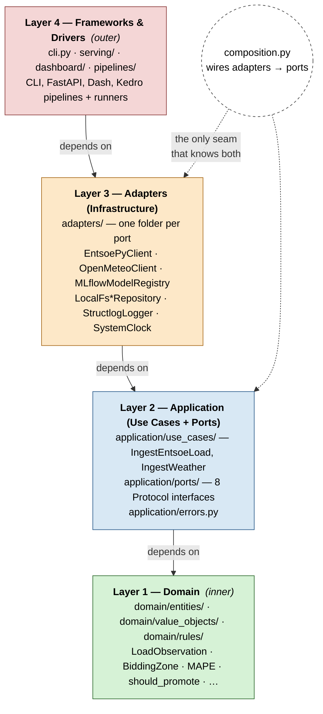
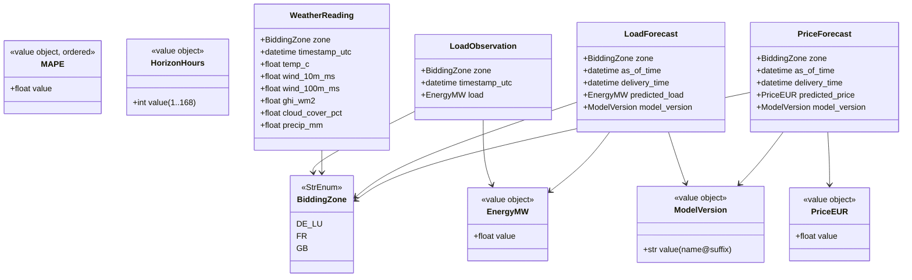
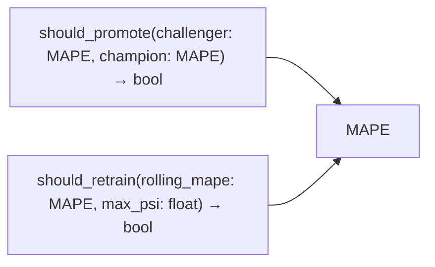
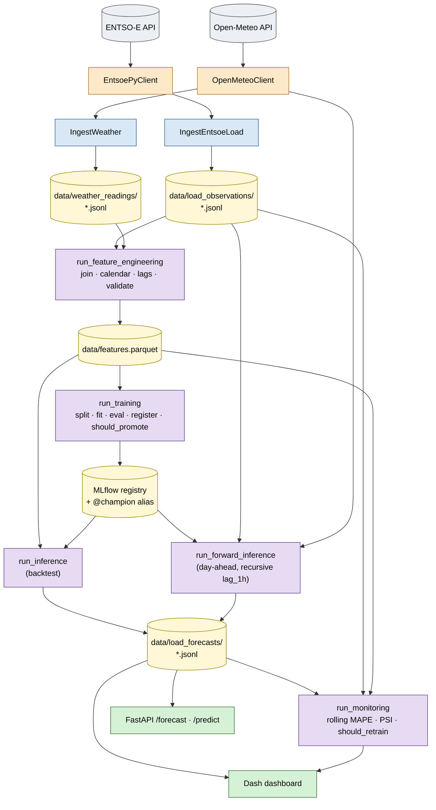
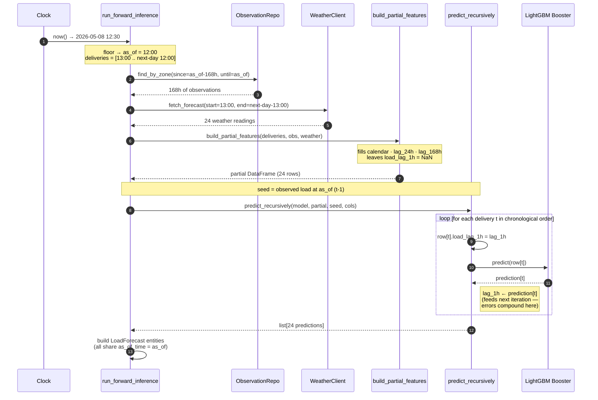
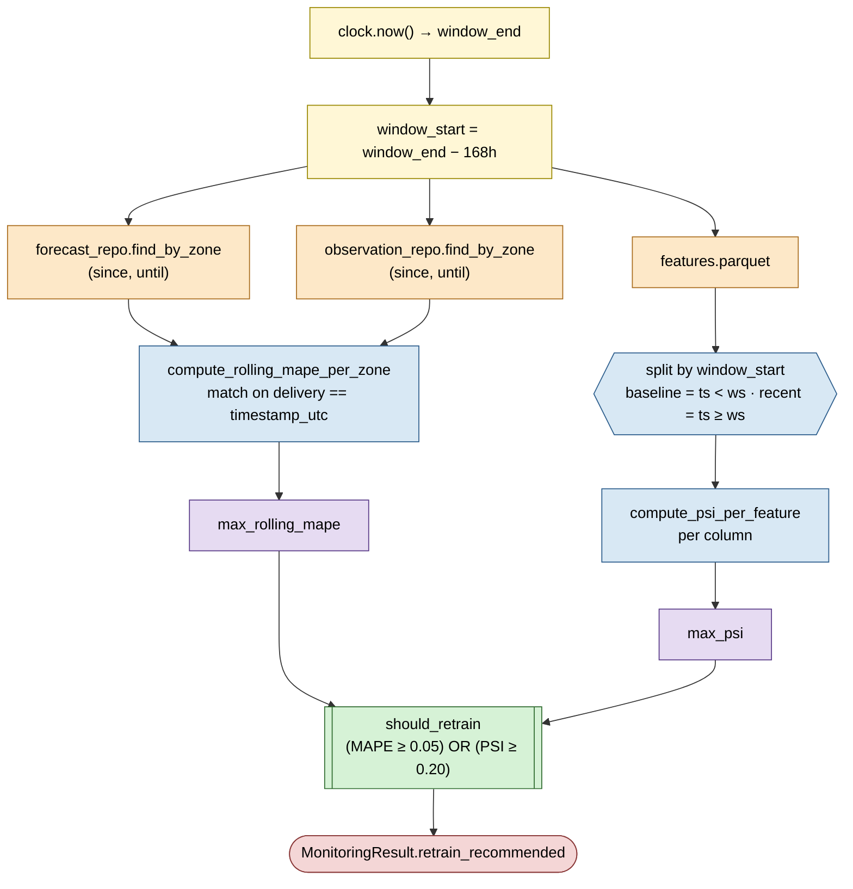
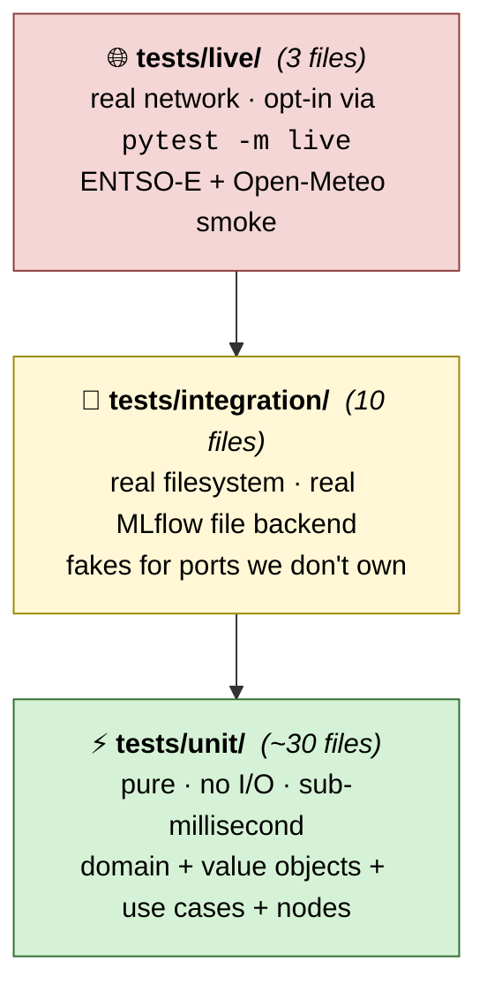
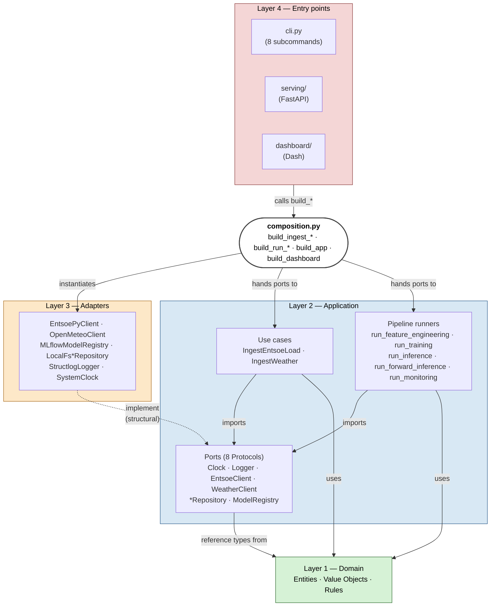

# Energy Forecaster — System Design

A walkthrough of every module in the project: what it is, what it depends on,
and how it fits the overall architecture. Read top-to-bottom for a guided tour;
jump to the file index at the end to look up anything specific.

---

## 1. What this system is

A day-ahead electricity demand forecaster for three European bidding zones
(DE-LU, FR, GB). Built as a portfolio piece for production-grade MLOps.
Local-first today (laptop + filesystem + MLflow file store); the architecture
is set up so the lift to Azure is a swap of adapter classes, not a rewrite.

It exposes **eight entry points**, all sharing one composition root and one
set of port-typed dependencies:

```
CLI:  ingest │ weather │ features │ train │ predict │ forecast │ monitor
HTTP: /health, /forecast/{zone}, /predict     (uvicorn :8000)
UI:   dashboard                                (Dash :8050)
```

---

## 2. The architecture at a glance — clean architecture, ML edition



### The dependency rule (read once, don't break)

```
Domain     imports nothing from the project except other domain.
Application imports domain and ports — never a concrete adapter.
Adapters    import application + ports + their library (entsoe-py, mlflow, …).
Frameworks  wire everything via composition.py. No business logic.
```

If you find `mlflow`, `kedro`, `fastapi`, `entsoe-py`, `dash`, or `azure.*`
imported from `domain/` or `application/` — that's a bug. Those imports live in
`adapters/` or `frameworks` only.

---

## 3. Directory map — annotated

```
energy_price_prediction/
├── pyproject.toml          ← uv project, deps, ruff/mypy/pytest config
├── Makefile                ← lint, format, typecheck, test targets
├── .env.example            ← every EF_* env var with a documented default
├── data/                   ← gitignored: ingested JSONL + features.parquet + mlruns/
├── conf/                   ← reserved for Kedro YAML config (not used yet)
├── docs/
│   ├── PRD.docx            ← product requirements (the "what" and "why")
│   └── DESIGN.md           ← this file (the "how")
├── src/energy_forecaster/
│   ├── domain/             ← Layer 1 — pure Python, no I/O
│   ├── application/        ← Layer 2 — ports + use cases
│   ├── adapters/           ← Layer 3 — concrete implementations of ports
│   ├── pipelines/          ← Layer 4 — Kedro DAGs + programmatic runners
│   ├── serving/            ← Layer 4 — FastAPI app
│   ├── dashboard/          ← Layer 4 — Dash app
│   ├── contracts/          ← Pandera schemas (DataFrame boundaries)
│   ├── config/             ← Pydantic Settings (typed env-var loading)
│   ├── cli.py              ← argparse entrypoint with 8 subcommands
│   ├── composition.py      ← THE wiring file — adapters ↔ ports
│   └── __main__.py         ← `python -m energy_forecaster` shim
└── tests/
    ├── unit/               ← pure, no I/O, sub-millisecond, many
    ├── integration/        ← real filesystem, real MLflow, in-memory adapters
    └── live/               ← hits real APIs, opt-in via `pytest -m live`
```

---

## 4. Layer 1 — Domain

Pure Python. No `pandas`, no `numpy` in entity definitions. No frameworks. No I/O.

### 4.1 Value objects

Frozen dataclasses with `slots=True`, validated at construction. Replace
primitive obsession (`str` zone, raw `float` MAPE) with types that carry
their constraint with them.

```
domain/value_objects/
├── bidding_zone.py     BiddingZone        StrEnum: DE_LU | FR | GB
├── energy.py           EnergyMW           float ≥ 0, finite
├── price.py            PriceEUR           float ≥ 0, finite
├── horizon.py          HorizonHours       int 1..168
├── mape.py             MAPE               float ≥ 0, finite, order=True
└── model_version.py    ModelVersion       "name@suffix" form (alias or run-id)
```

### 4.2 Entities

Frozen dataclasses, slots, `__post_init__` validation. Carry value objects, not
primitives.

```
domain/entities/
├── load_observation.py   LoadObservation       (zone, timestamp_utc, load: EnergyMW)
├── weather_reading.py    WeatherReading        (zone, timestamp_utc, temp_c, wind_*, …)
├── load_forecast.py      LoadForecast          (zone, as_of_time, delivery_time, predicted_load: EnergyMW, model_version: ModelVersion)
└── price_forecast.py     PriceForecast         (zone, as_of_time, delivery_time, predicted_price: PriceEUR, model_version)
```

Invariants enforced at construction time:
- `delivery_time > as_of_time` on every forecast
- timezone-aware UTC datetimes only (rejected if naive — `_validation.require_utc`)
- `cloud_cover_pct ∈ [0, 100]` on weather

### 4.3 Rules — pure business policy as functions

```
domain/rules/
├── promotion.py    should_promote(challenger: MAPE, champion: MAPE, *, delta=0.005) -> bool
└── retrain.py      should_retrain(*, rolling_mape: MAPE, max_psi: float,
                                    mape_threshold=0.05, psi_threshold=0.20) -> bool
```

Both inclusive at threshold. Both pure: same inputs → same answer, no side
effects, no I/O. Reused from training, monitoring, the dashboard, and any
future CI gate without a single import change.

### 4.4 Object relationships



Rules consume value objects directly — no entity dependency:



---

## 5. Layer 2 — Application

### 5.1 Ports — eight Protocol interfaces

Every external dependency reaches the application layer through a `Protocol`.
Concrete implementations live in `adapters/`. **Swapping LocalFs for Azure
Blob is changing one line in composition.py.**

| Port | File | Methods |
|---|---|---|
| `Clock` | `clock.py` | `now() -> datetime` |
| `Logger` | `logger.py` | `bind(**)`, `info`, `warning`, `error`, `debug` |
| `EntsoeClient` | `entsoe_client.py` | `fetch_load(zone, start, end)` |
| `WeatherClient` | `weather_client.py` | `fetch_weather`, `fetch_forecast` |
| `LoadObservationRepository` | `load_observation_repository.py` | `add_many`, `find_by_zone` |
| `WeatherReadingRepository` | `weather_reading_repository.py` | `add_many` |
| `LoadForecastRepository` | `load_forecast_repository.py` | `add_many`, `find_by_zone` |
| `ModelRegistry` | `model_registry.py` | `register`, `load`, `get_alias`, `set_alias`, `get_metric` |

### 5.2 Use cases — orchestrate ports + domain

Use cases hold business logic that needs more than one port. They take ports
through their constructor and never branch on environment.

```
application/use_cases/
├── ingest_entsoe_load.py    IngestEntsoeLoad
│   ports: EntsoeClient, LoadObservationRepository, Clock, Logger
│   .execute(zones, start, end) -> IngestEntsoeLoadResult
│
└── ingest_weather.py        IngestWeather
    ports: WeatherClient, WeatherReadingRepository, Clock, Logger
    .execute(zones, start, end) -> IngestWeatherResult
```

Why aren't `predict`, `train`, `monitor` use cases? Their orchestration is
multi-input and pipeline-shaped (Parquet read, model load, multi-step compute).
They live in `pipelines/<name>/runner.py` instead — same architectural slot,
different file convention.

### 5.3 Errors

```
application/errors.py
    ApplicationError              ← base (caught at framework boundaries)
    └── DataSourceUnavailableError ← upstream out (entsoe, open-meteo, mlflow)
```

Adapters translate library-specific exceptions into these. The CLI maps
`ApplicationError → exit code 1`; the FastAPI app maps it to HTTP 502.

---

## 6. Layer 3 — Adapters

One folder per port. Each contains:
- A real adapter (production)
- An in-memory adapter where useful (synthetic data for local demos)
- Real adapters import their library; ports stay library-free.

```
adapters/
├── clock/
│   └── system_clock.py            SystemClock          → datetime.now(UTC)
│
├── entsoe_client/
│   ├── entsoe_py.py               EntsoePyClient       → real ENTSO-E HTTP
│   └── in_memory.py               InMemoryEntsoeClient → deterministic synthetic
│
├── weather_client/
│   ├── open_meteo.py              OpenMeteoClient      → /v1/archive + /v1/forecast
│   └── in_memory.py               InMemoryWeatherClient → diurnal curve generator
│
├── load_observation_repo/
│   └── local_fs.py                LocalFsLoadObservationRepository
│                                  → JSONL: <root>/load_observations/<zone>.jsonl
│
├── weather_reading_repo/
│   └── local_fs.py                LocalFsWeatherReadingRepository
│                                  → JSONL: <root>/weather_readings/<zone>.jsonl
│
├── load_forecast_repo/
│   └── local_fs.py                LocalFsLoadForecastRepository
│                                  → JSONL: <root>/load_forecasts/<zone>.jsonl
│
├── model_registry/
│   └── mlflow_registry.py         MLflowModelRegistry  → MLflow file/server backend
│
└── logger/
    └── structlog_logger.py        StructlogLogger      → JSON-line stdout, bind() chain
```

### Port → Adapter mapping (today vs. cloud target)

| Port | Local adapter (now) | Cloud adapter (planned) |
|---|---|---|
| `Clock` | `SystemClock` | `SystemClock` (unchanged) |
| `Logger` | `StructlogLogger` | `StructlogLogger` + App Insights sink |
| `EntsoeClient` | `EntsoePyClient` / `InMemoryEntsoeClient` | same (the HTTP API is the API) |
| `WeatherClient` | `OpenMeteoClient` / `InMemoryWeatherClient` | same |
| `*Repository` | `LocalFs*Repository` | `Postgres*Repository` (Azure Postgres Flexible Server) |
| `ModelRegistry` | `MLflowModelRegistry` (file backend) | `MLflowModelRegistry` (Azure Blob backend) |

The application layer doesn't change. Use cases keep importing the Protocol.
Composition picks the right concrete one per environment.

---

## 7. Layer 4 — Frameworks

### 7.1 CLI — `cli.py`

Single argparse-based entrypoint exposed via `[project.scripts]` as
`energy-forecaster`. Eight subcommands, each a thin dispatch to a `_run_*`
handler that:
1. Builds the wired use case via composition.
2. Binds a `correlation_id` UUID to the logger.
3. Calls the use case.
4. Renders a result block to stdout.

```
energy-forecaster
├── ingest    --zone --start --end          IngestEntsoeLoad use case
├── weather   --zone --start --end          IngestWeather use case
├── features  --output                      run_feature_engineering
├── train     --features                    run_training
├── predict   --model --features --hours    run_inference (backtest)
├── forecast  --model --zone --hours --as-of  run_forward_inference (day-ahead)
├── monitor   --features --recent-hours     run_monitoring
├── serve     --host --port                 build_app → uvicorn
└── dashboard --host --port                 build_dashboard → Dash.run
```

### 7.2 HTTP — `serving/`

```
serving/
├── schemas.py    Pydantic DTOs    HealthResponse, ForecastResponse,
│                                  PredictRequest, PredictResponse
└── app.py        create_app(settings, *, logger,
                              forecast_repo, inference_runner) -> FastAPI
```

Three routes:
- `GET  /health`               → environment + status
- `GET  /forecast/{zone}`      → list[ForecastResponse], filterable by since/until
- `POST /predict`              → triggers inference, returns InferenceResult

Each route reads `X-Request-Id` header (or generates a UUID4) and binds it to a
per-request logger. `ApplicationError → 502`, anything else `→ 500`.

### 7.3 Dashboard — `dashboard/`

```
dashboard/
├── charts.py    Pure plotly figure builders        (no I/O)
│                  actual_vs_predicted(df, zone)    → go.Figure
│                  psi_by_feature(psi, top_n)       → go.Figure
├── data.py      Pure-ish data loaders              (port reads → DataFrame)
│                  load_actual_vs_predicted(...)    → pd.DataFrame
└── app.py       create_app(settings, *, logger,
                            forecast_repo, observation_repo,
                            monitoring_runner, clock) -> dash.Dash
```

Layout: zone dropdown · days-back dropdown · "Refresh drift" button · line
chart (actual vs predicted) · drift summary text · top-5 PSI bar chart.
Two callbacks: one for the line chart (zone + days inputs), one for the drift
panel + PSI chart (button click input).

### 7.4 Pipelines — `pipelines/`

Each pipeline has the same shape:

```
pipelines/<name>/
├── nodes.py       pure functions that operate on DataFrames
├── pipeline.py    Kedro Pipeline object wiring nodes into a DAG
└── runner.py      programmatic runner: ports + DataCatalog + SequentialRunner
                   + dataclass result type (TrainingResult, InferenceResult, …)
```

Exception: `pipelines/monitoring/` has **no `pipeline.py`** — its two
independent compute steps don't justify the Kedro overhead. Same architectural
rule (port-touching only in the runner) but the runner calls node functions
directly.

```
pipelines/
├── feature_engineering/    JSONL → join → calendar features → lag features → Parquet
├── training/               Parquet → split → fit LightGBM → eval → register → promote?
├── inference/
│   ├── nodes.py + pipeline.py + runner.py     run_inference     (backtest)
│   └── forward.py                             helpers for       (day-ahead)
│                                                run_forward_inference
└── monitoring/             nodes.py + metrics.py + runner.py    (no Kedro DAG)
                            forecasts ⊕ observations → MAPE per zone
                            features split → PSI per feature
                            should_retrain rule → MonitoringResult
```

---

## 8. The composition root — `composition.py`

The single module that knows about both ports and concrete adapters. Every
other module receives its dependencies through a constructor or factory.

```
composition.py
├── build_ingest_entsoe_load(settings, *, logger)         → IngestEntsoeLoad
├── build_ingest_weather(settings, *, logger)             → IngestWeather
├── build_run_feature_engineering(settings)               → Callable
├── build_run_training(settings)                          → Callable
├── build_run_inference(settings)                         → Callable (backtest)
├── build_run_forward_inference(settings)                 → Callable (day-ahead)
├── build_run_monitoring(settings)                        → Callable
├── build_app(settings, *, logger)                        → object (FastAPI)
└── build_dashboard(settings, *, logger)                  → object (Dash)
```

### Branching policy

Every conditional adapter selection lives here. Nothing else in the codebase
branches on environment.

```
ENTSO-E:    settings.entsoe_api_key is None  → InMemoryEntsoeClient
            else                              → EntsoePyClient

Weather:    settings.weather_source = "synthetic"  → InMemoryWeatherClient
            settings.weather_source = "open_meteo" → OpenMeteoClient

Repos:      always                           → LocalFs*Repository
            (Postgres adapters land in 9a)
```

### What composition assembles

```
build_run_inference(settings) returns a closure that captures:
                 ┌─ MLflowModelRegistry(tracking_uri=settings.mlflow_tracking_uri)
                 ├─ LocalFsLoadForecastRepository(root=settings.local_data_root)
                 ├─ SystemClock()
                 └─ default features path = settings.local_data_root/features.parquet

When called: _run(model_version, features_path?, hours?) → InferenceResult
```

Same shape for every other `build_run_*` function — closure that captures
adapters, exposes per-call overrides for the things that vary.

---

## 9. End-to-end data flow

### 9.1 Ingest → train → predict → monitor



### 9.2 Forward (day-ahead) inference — recursive prediction



The recursive `load_lag_1h` chain is the part to watch: prediction errors at
hour _k_ become the lag input for hour _k+1_, so any systematic bias stacks
forward through the horizon. Acceptable for 24-hour day-ahead windows; gets
noisy past that.

### 9.3 The monitoring decision flow



---

## 10. Configuration — `config/settings.py`

One Pydantic `Settings` class. Every other module imports `settings: Settings`,
never `os.environ`.

```python
class Environment(StrEnum): LOCAL, AZURE
class Settings(BaseSettings):
    environment: Environment = LOCAL
    log_level: str = "INFO"
    local_data_root: Path = Path("./data")
    mlflow_tracking_uri: str = "file:./data/mlruns"
    entsoe_api_key: SecretStr | None = None       # None → InMemoryEntsoeClient
    weather_source: Literal["synthetic", "open_meteo"] = "synthetic"

    model_config = SettingsConfigDict(
        env_prefix="EF_",
        env_file=".env",
        extra="forbid",
    )
```

`get_settings()` is `lru_cache(maxsize=1)`-ed so tests can clear it between
runs and overrides via `monkeypatch.setenv` flow through.

---

## 11. Contracts — `contracts/`

Pandera schemas at every DataFrame boundary. Each Kedro node that produces or
consumes a DataFrame is decorated with `@pa.check_types` so violations land at
the boundary, not three nodes downstream.

```
contracts/
├── load_observation_schema.py    LoadObservationSchema      (timestamp_utc unique, load ≥ 0, ≤ 200_000)
├── weather_reading_schema.py     WeatherReadingSchema       (six numeric columns, cloud ∈ [0,100])
└── feature_matrix_schema.py      FeatureMatrixSchema        (target + features, lag columns nullable)
```

All schemas use `coerce=False` and `strict=True`. The converter functions in
adapters do explicit casts (e.g. `astype("datetime64[ns, UTC]")`) so a schema
rejection means a real shape mismatch, not a silent type coercion.

---

## 12. The testing pyramid



Total: **456 tests, 99.42% coverage**, every domain/application/adapter module
at 100%. Run with `make test` (skips `live`); `make test-live` opts in.

### Where the tests live (high level)

| Test target | Path | Style |
|---|---|---|
| Domain entities + value objects | `tests/unit/domain/` | Pure unit |
| Domain rules | `tests/unit/domain/rules/` | Pure unit |
| Use cases | `tests/unit/application/use_cases/` | Use fakes from `tests/unit/application/fakes.py` |
| Adapters (real APIs mocked) | `tests/unit/adapters/` | Monkeypatch `requests.get` etc. |
| Adapters (filesystem/MLflow real) | `tests/integration/adapters/` | `tmp_path` + real I/O |
| Pipeline runners | `tests/integration/pipelines/<name>/` | Synthetic features.parquet, fake registry |
| FastAPI app | `tests/integration/serving/` | `TestClient` |
| Dash app | `tests/integration/dashboard/` | Component tree + callback factories |
| CLI | `tests/unit/test_cli.py` | `main(["..."])`, monkeypatch composition build_* |
| Composition | `tests/unit/test_composition.py` | Smoke + monkeypatch runner stubs |
| Config | `tests/unit/config/test_settings.py` | env-var loading, validation |
| Live (opt-in) | `tests/live/` | Real ENTSO-E + Open-Meteo, marked `pytest.mark.live` |

`tests/unit/application/fakes.py` is the **shared in-memory test harness**:
`FakeClock`, `FakeEntsoeClient`, `FakeWeatherClient`, `FakeLogger`,
`FakeModelRegistry`, `FakeLoadObservationRepository`,
`FakeLoadForecastRepository`, `FakeWeatherReadingRepository`. They're not
mocks — they're real implementations of the same Protocols, just backed by
in-process state.

---

## 13. Cross-cutting wiring map

How the pieces connect when you hit a CLI command, an HTTP endpoint, or click
in the dashboard:



---

## 14. File index — every Python file with one-liner

### `src/`

| File | What it is |
|---|---|
| `__init__.py` | Re-exports the public domain types for ergonomic imports. |
| `__main__.py` | `python -m energy_forecaster` shim that calls `cli.main()`. |
| `cli.py` | argparse entrypoint with eight subcommands and their handlers. |
| `composition.py` | The wiring file — every `build_*` function lives here. |

#### `src/config/`

| File | What it is |
|---|---|
| `settings.py` | `Settings` Pydantic class + `get_settings()` cached factory. |

#### `src/domain/`

| File | What it is |
|---|---|
| `_validation.py` | `require_utc(dt)` helper — rejects naive datetimes. |
| `entities/load_observation.py` | `LoadObservation` (zone, ts, EnergyMW). |
| `entities/weather_reading.py` | `WeatherReading` (six numeric fields + zone + ts). |
| `entities/load_forecast.py` | `LoadForecast` (predicted_load, model_version, as_of/delivery times). |
| `entities/price_forecast.py` | `PriceForecast` (mirror of LoadForecast for prices — reserved for chunk 8e+). |
| `value_objects/bidding_zone.py` | `BiddingZone` StrEnum. |
| `value_objects/energy.py` | `EnergyMW` non-negative finite float. |
| `value_objects/price.py` | `PriceEUR` non-negative finite float. |
| `value_objects/horizon.py` | `HorizonHours` 1..168 int. |
| `value_objects/mape.py` | `MAPE` non-negative finite float, ordered. |
| `value_objects/model_version.py` | `ModelVersion("name@suffix")` — alias or run-id. |
| `rules/promotion.py` | `should_promote` — challenger vs champion gate. |
| `rules/retrain.py` | `should_retrain` — OR of MAPE breach and PSI breach. |

#### `src/application/`

| File | What it is |
|---|---|
| `errors.py` | `ApplicationError` + `DataSourceUnavailableError`. |
| `ports/clock.py` | `Clock.now() -> datetime` Protocol. |
| `ports/logger.py` | `Logger` Protocol — bind, info, warning, error, debug. |
| `ports/entsoe_client.py` | `EntsoeClient.fetch_load(zone, start, end)` Protocol. |
| `ports/weather_client.py` | `WeatherClient.fetch_weather` + `fetch_forecast`. |
| `ports/load_observation_repository.py` | Repo Protocol — `add_many`, `find_by_zone`. |
| `ports/weather_reading_repository.py` | Repo Protocol — `add_many`. |
| `ports/load_forecast_repository.py` | Repo Protocol — `add_many`, `find_by_zone`. |
| `ports/model_registry.py` | Registry Protocol — register, load, get/set_alias, get_metric. |
| `use_cases/ingest_entsoe_load.py` | `IngestEntsoeLoad` use case + `IngestEntsoeLoadResult`. |
| `use_cases/ingest_weather.py` | `IngestWeather` use case + `IngestWeatherResult`. |

#### `src/adapters/`

| File | What it is |
|---|---|
| `clock/system_clock.py` | `SystemClock` — `datetime.now(UTC)`. |
| `entsoe_client/entsoe_py.py` | `EntsoePyClient` — real ENTSO-E via entsoe-py. |
| `entsoe_client/in_memory.py` | `InMemoryEntsoeClient` — synthetic load curves. |
| `weather_client/open_meteo.py` | `OpenMeteoClient` — `/v1/archive` + `/v1/forecast`. |
| `weather_client/in_memory.py` | `InMemoryWeatherClient` — diurnal generator. |
| `load_observation_repo/local_fs.py` | `LocalFsLoadObservationRepository` — JSONL writer + `find_by_zone`. |
| `weather_reading_repo/local_fs.py` | `LocalFsWeatherReadingRepository` — JSONL writer. |
| `load_forecast_repo/local_fs.py` | `LocalFsLoadForecastRepository` — JSONL writer + `find_by_zone`. |
| `model_registry/mlflow_registry.py` | `MLflowModelRegistry` — register, load, alias, metrics. |
| `logger/structlog_logger.py` | `StructlogLogger` — JSON-line stdout + `bind()` chain. |

#### `src/contracts/`

| File | What it is |
|---|---|
| `load_observation_schema.py` | Pandera schema: timestamp_utc unique, load ∈ [0, 200_000]. |
| `weather_reading_schema.py` | Pandera schema: six numeric columns, cloud ∈ [0, 100]. |
| `feature_matrix_schema.py` | Pandera schema: features + load_mw target, lag cols nullable. |

#### `src/pipelines/`

| File | What it is |
|---|---|
| `feature_engineering/io.py` | JSONL → DataFrame loaders + UTC normalisation. |
| `feature_engineering/nodes.py` | `join_load_and_weather`, `add_time_features`, `add_lag_features`. |
| `feature_engineering/pipeline.py` | Kedro DAG wiring the three nodes. |
| `feature_engineering/runner.py` | `run_feature_engineering` — runs the DAG, writes Parquet. |
| `training/nodes.py` | `prepare_training_data`, `train_model`, `evaluate_model`, `collect_artifacts`. |
| `training/pipeline.py` | Kedro DAG for the four training nodes. |
| `training/runner.py` | `run_training` + `TrainingResult`; calls registry + promotion rule. |
| `inference/nodes.py` | Backtest nodes: `slice_recent_features`, `predict_loads`, `build_forecasts`. |
| `inference/pipeline.py` | Kedro DAG for backtest inference. |
| `inference/runner.py` | `run_inference` (backtest) + `run_forward_inference` (day-ahead). |
| `inference/forward.py` | Pure helpers for forward inference: `build_partial_features`, `predict_recursively`. |
| `monitoring/metrics.py` | `mape`, `population_stability_index` — pure numerical helpers. |
| `monitoring/nodes.py` | `compute_rolling_mape_per_zone`, `compute_psi_per_feature`. |
| `monitoring/runner.py` | `run_monitoring` + `MonitoringResult`; applies `should_retrain`. |

#### `src/serving/`

| File | What it is |
|---|---|
| `schemas.py` | Pydantic DTOs for HTTP I/O — Health/Forecast/Predict req+resp. |
| `app.py` | `create_app` FastAPI factory; wires three routes + per-request logger binding. |

#### `src/dashboard/`

| File | What it is |
|---|---|
| `charts.py` | Pure plotly figure builders — `actual_vs_predicted`, `psi_by_feature`. |
| `data.py` | `load_actual_vs_predicted` — port reads, returns chart-shaped DataFrame. |
| `app.py` | `create_app` Dash factory + callback factories. |

### `tests/`

| Path | What it covers |
|---|---|
| `unit/test_smoke.py` | Package importable; `__init__.py` re-exports work. |
| `unit/test_composition.py` | Each `build_*` function returns the expected concrete types. |
| `unit/test_cli.py` | Argparse parsing, every subcommand handler, error paths. |
| `unit/application/fakes.py` | The shared in-memory test harness (8 fakes). |
| `unit/application/use_cases/test_ingest_entsoe_load.py` | Use-case behaviour against fakes. |
| `unit/application/use_cases/test_ingest_weather.py` | Use-case behaviour against fakes. |
| `unit/config/test_settings.py` | Settings env-var loading + validation + lru_cache reset. |
| `unit/contracts/test_load_observation_schema.py` | Schema accept + reject + edge cases. |
| `unit/contracts/test_weather_reading_schema.py` | Schema accept + reject + edge cases. |
| `unit/domain/rules/test_promotion.py` | `should_promote` truth table + custom delta. |
| `unit/domain/rules/test_retrain.py` | `should_retrain` truth table + custom thresholds. |
| `unit/domain/test_value_objects.py` | All six value objects' constructors + invariants. |
| `unit/domain/test_load_observation.py` | Entity invariants. |
| `unit/domain/test_weather_reading.py` | Entity invariants. |
| `unit/domain/test_load_forecast.py` | Entity invariants. |
| `unit/domain/test_price_forecast.py` | Entity invariants. |
| `unit/adapters/entsoe_client/test_entsoe_py.py` | Real adapter, mocked HTTP. |
| `unit/adapters/entsoe_client/test_in_memory.py` | Synthetic adapter contract. |
| `unit/adapters/weather_client/test_in_memory.py` | Synthetic adapter, both methods. |
| `unit/adapters/weather_client/test_open_meteo.py` | Real adapter, mocked HTTP, archive + forecast. |
| `unit/adapters/logger/test_structlog_logger.py` | Logger bind chain + JSON output shape. |
| `unit/pipelines/feature_engineering/test_nodes.py` | Each node's pure transformation. |
| `unit/pipelines/training/test_nodes.py` | Each node's pure transformation. |
| `unit/pipelines/inference/test_nodes.py` | Backtest nodes. |
| `unit/pipelines/inference/test_forward.py` | Forward helpers + recursive predictor. |
| `unit/pipelines/monitoring/test_metrics.py` | mape + PSI helpers (incl. binary, NaN, degenerate inputs). |
| `unit/pipelines/monitoring/test_nodes.py` | Compute rolling MAPE / PSI nodes. |
| `unit/serving/test_schemas.py` | Pydantic schema round-trips + validation. |
| `unit/dashboard/test_charts.py` | Pure chart builders (incl. empty-state + PSI ordering). |
| `unit/dashboard/test_data.py` | `load_actual_vs_predicted` against fakes. |
| `integration/adapters/test_local_fs_load_observation_repository.py` | Real filesystem JSONL round-trip + dedup + find_by_zone. |
| `integration/adapters/test_local_fs_weather_reading_repository.py` | Real filesystem JSONL round-trip + dedup. |
| `integration/adapters/test_local_fs_load_forecast_repository.py` | Real filesystem JSONL round-trip + find_by_zone. |
| `integration/adapters/test_system_clock.py` | UTC + monotonic increase. |
| `integration/adapters/model_registry/test_mlflow_registry.py` | Real MLflow file backend: register, load, alias, metric. |
| `integration/pipelines/feature_engineering/test_runner.py` | End-to-end: JSONL on disk → Parquet on disk. |
| `integration/pipelines/training/test_runner.py` | End-to-end: features → trained model registered. |
| `integration/pipelines/inference/test_runner.py` | Backtest run + forward run, fakes for ports. |
| `integration/pipelines/monitoring/test_runner.py` | Five scenarios: calm, drift, high-MAPE, no obs, no baseline. |
| `integration/serving/test_app.py` | TestClient: every route + header + error path + composed `build_app`. |
| `integration/dashboard/test_app.py` | Layout component-tree + callback factories. |
| `live/test_entsoe_py_live.py` | Real ENTSO-E HTTP — opt-in. |
| `live/test_open_meteo_live.py` | Real Open-Meteo HTTP — opt-in. |

---

## 15. How to read the project for onboarding

If you're new to the codebase, walk it in this order:

1. **`docs/PRD.docx`** — what we're building and why.
2. **`.claude/CLAUDE.md`** — the engineering rulebook (architecture, code rules,
   definition of done).
3. **`src/energy_forecaster/domain/`** — the entities and rules. ~5 minutes,
   no surprises, no dependencies. This is the project's vocabulary.
4. **`src/energy_forecaster/application/ports/`** — eight interfaces. The
   *vocabulary of the things we depend on*.
5. **`src/energy_forecaster/application/use_cases/ingest_entsoe_load.py`** —
   the simplest use case end-to-end. Read it with the ports it imports open
   in another tab.
6. **`src/energy_forecaster/composition.py`** — the wiring. Pair this with
   `src/energy_forecaster/cli.py` to see how a command lights up.
7. **`src/energy_forecaster/pipelines/training/runner.py`** — the most
   information-dense runner; once this clicks, the others follow.
8. **`src/energy_forecaster/pipelines/inference/runner.py`** — backtest + forward
   side-by-side; the recursive prediction helper in `forward.py` is the
   trickiest piece in the codebase.
9. **`src/energy_forecaster/serving/app.py`** + **`dashboard/app.py`** — same
   pattern at the framework boundary, once for HTTP, once for UI.

The `make check` target runs lint, format-check, mypy strict, and pytest with
the coverage gate. **A green `make check` is the contract for any change.**

---

## 16. Glossary

- **Bidding zone.** A geographic area with a single wholesale electricity
  price. We forecast for DE-LU, FR, GB.
- **Day-ahead.** A market that clears today for delivery hours tomorrow. Our
  primary forecast horizon.
- **As-of time.** The moment a forecast was *issued*. All 24 day-ahead
  forecasts share the same `as_of_time`.
- **Delivery time.** The hour the forecast is *for*.
- **MAPE.** Mean Absolute Percentage Error. Our headline accuracy metric.
- **PSI.** Population Stability Index. Detects feature distribution drift.
  < 0.10 stable, 0.10–0.20 moderate, ≥ 0.20 significant.
- **Recursive prediction.** Walking through forecast hours chronologically,
  feeding each prediction back as the next iteration's `load_lag_1h` input.
- **Champion / challenger.** The currently-deployed model vs. a candidate
  trying to replace it. `should_promote` decides; the model registry's
  `@champion` alias points to the winner.
- **Composition root.** The single module (`composition.py`) that wires
  concrete adapters to ports and hands them to use cases.
- **Port.** A `Protocol` interface owned by the application layer.
- **Adapter.** A concrete implementation of a port, owned by the
  infrastructure layer.
